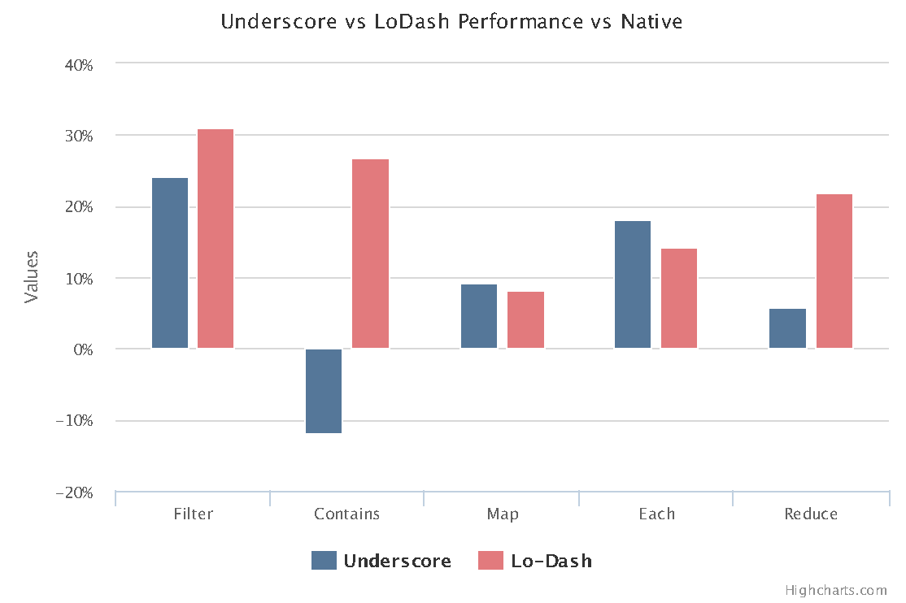

# Cumulocity lodash 4.x Migration (and Style) Guide

## Preferable Functional Methods
Conventionally speaking, we should favor lodash methods over their native and/or Angular counterparts.

> Why?
- [lodash blows away the performance of native functional methods.](http://benmccormick.org/2014/11/12/underscore-vs-lodash/)
- lodash has more features for those functional methods such as _chaining_ and _iteratee shorthand_.
- lodash provides compatibility consistency for browser which hasn't really natively supported these functions yet (read: IE).
- lodash enables us to produce code in better clarity (and of course – improve style consistency :wink:), e.g. compare: `Object.hasOwnProperty` vs `_.has`, `angular.forEach` vs `_.forEach`.

Here are the two equivalence tables (note that the lists maybe incomplete, I only extract the common ones we use in our code):

### Native
| Native method | lodash method |
| --- | --- |
| `Function.prototype.bind` | `_.bind` |
| `Array.prototype.forEach` | `_.forEach` |
| `Array.prototype.map` | `_.map` |
| `Array.prototype.filter` | `_.filter` |
| `Array.prototype.reduce` | `_.reduce` |
| `Object.hasOwnProperty` | `_.has` |
| `Object.keys` | `_.keys` |
| `Object.values` | `_.values` |

### Angular
| Angular method | lodash method |
| --- | --- |
| `angular.bind` (beware that Angular [`.bind`](https://docs.angularjs.org/api/ng/function/angular.bind) function signature expects different arguments order) | `_.bind` |
| `angular.copy` | `_.cloneDeep` |
| `angular.equals` | `_.isEqual` |
| `angular.extend` | `_.assign` |
| `angular.forEach` | `_.forEach` |
| `angular.identity` | `_.identity` |
| `angular.isArray` | `_.isArray` |
| `angular.isDate` | `_.isDate` |
| `angular.isDefined` | `!_.isUndefined` |
| `angular.isElement` | `_.isElement` |
| `angular.isFunction` | `_.isFunction` |
| `angular.isNumber` | `_.isNumber` |
| `angular.isObject` | `_.isObject` |
| `angular.isString` | `_.isString` |
| `angular.isUndefined` | `_.isUndefined` |
| `angular.merge` | `_.merge` |
| `angular.noop` | `_.noop` |

## Preferable lodash Functional Method Aliases
In our code, lodash functional method aliases have been used inconsistently. :disappointed: So, please help yourself to make it more consistent!

| Alias | Favorable alias |
| --- | --- |
| `_.all` | `_.every` |
| `_.any` | `_.some` |
| `_.each` | `_.forEach` |
| `_.extend` (beware that lodash 4.x [`.extend`](https://lodash.com/docs/4.16.2#assignIn) behaves differently and **not** an alias for `.assign`) | `_.assign` |
| `_.unique` | `_.uniq` |
| `_.chain` | `_()` (yup, prefer implicit chaining. Also, beware that in implicit chaining, the wrapper [methods that are not chainable](https://lodash.com/docs/4.16.2#lodash) will end the chaining without the need of calling `.value()`, e.g. `.forEach`, `.reduce`) |

## Breaking Changes in 4.x (Method Removals and Renames)
[R.T.F. Changelog](https://github.com/lodash/lodash/wiki/Changelog#v400). :shipit:

Known to be used in our project are:
- `_.include` -> `_.includes`
- `_.contains` -> `_.includes`
- `_.pluck` -> `_.map` with iteratee shorthand
- `_.where` -> `_.filter` with iteratee shorthand
- `_.first` -> `_.head`
- `_.invoke` -> `_.invokeMap`
- `_.rest` -> `_.tail`
